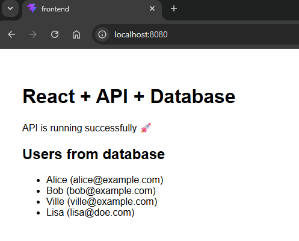

# Phases for taking the final project into use

## 1. Download the ZIP package and extract it

## 2. Build the database (enter the command in the root folder) 

```bash
docker compose up -d db
```

## 3. Verify that DB works

```bash
docker exec -it fullstack-db psql -U appuser -d appdb
```

## 4. Build the api (enter the command in the root folder) 

```bash
docker compose up -d api
```

## 5. Verify that API works

```bash
curl http://localhost:3000/api/health
```

```bash
curl http://localhost:3000/api/users
```

```bash
curl -X POST http://localhost:3000/api/users \
  -H "Content-Type: application/json" \
  -d '{"name":"John","email":"john@doe.com"}'
```

## 6. Build the frontend (enter the command in the root folder) 

```bash
docker compose up -d frontend
```

## 7. Verify that frontend works

```bash
curl http://localhost:8080/api/health
```

```bash
curl http://localhost:8080/api/users
```

```bash
curl -X POST http://localhost:8080/api/users \
  -H "Content-Type: application/json" \
  -d '{"name":"Lisa","email":"lisa@doe.com"}'
```
---



> [!NOTE]
> Everything ought to be set.

# Starting the development phase

## Database 

### 1. First stop the entire stack 

```bash
docker compose stop
```

### 2. Modify the 01_init.sql file or add a new one, for example 02_myapp.sql

### 3. Remove all containers with their images, or just the database

**ALL**

```bash
docker compose down --rmi all --volumes --remove-orphans
```

**JUST DATABASE**

```bash
docker compose down db --volumes
```

### 4.  Bring the database back up

```bash
docker compose up --build -d db
```

### 5. Verify that DB works

```bash
docker exec -it fullstack-db psql -U appuser -d appdb
```

## Backend (API)

### 1. Stop the API 

```bash
docker compose stop api
```

### 2. Go to the backend folder and start the service in development mode

**Install depencies if needed**

```bash
npm install
```

**Start the server**

```bash
npm run dev
```

### 3. Add the new API routes to the `server.js` file

### 4. Remove API container with image

```bash
docker compose rm -f api
```

### 5.  Bring the API back up

```bash
docker compose up --build -d api
```

### 6. Verify that API works

**Note that you now need to use the routes you have added and modified.**

```bash
curl http://localhost:3000/api/health
```

```bash
curl http://localhost:3000/api/users
```

```bash
curl -X POST http://localhost:3000/api/users \
  -H "Content-Type: application/json" \
  -d '{"name":"John","email":"john@doe.com"}'
```

## Fronted (React app)

### 1. Stop the frontend 

```bash
docker compose stop frontend
```

### 2. Go to the frontend folder and start the service in development mode

**Install depencies if needed**

```bash
npm install
```

**Start the server**

```bash
npm run dev
```

### 3. Customize the application to suit your environment

### 4. Remove frontend container with image

```bash
docker compose rm -f frontend
```

### 5.  Bring the frontend back up

```bash
docker compose up --build -d frontend
```

### 6. Verify that frontend works

**Note that you now need to use the routes you have added and modified.**

```bash
curl http://localhost:8080/api/health
```

```bash
curl http://localhost:8080/api/users
```

```bash
curl -X POST http://localhost:8080/api/users \
  -H "Content-Type: application/json" \
  -d '{"name":"Lisa","email":"lisa@doe.com"}'
```
---

> [!NOTE]
> Repeat the process until the result is satisfactory